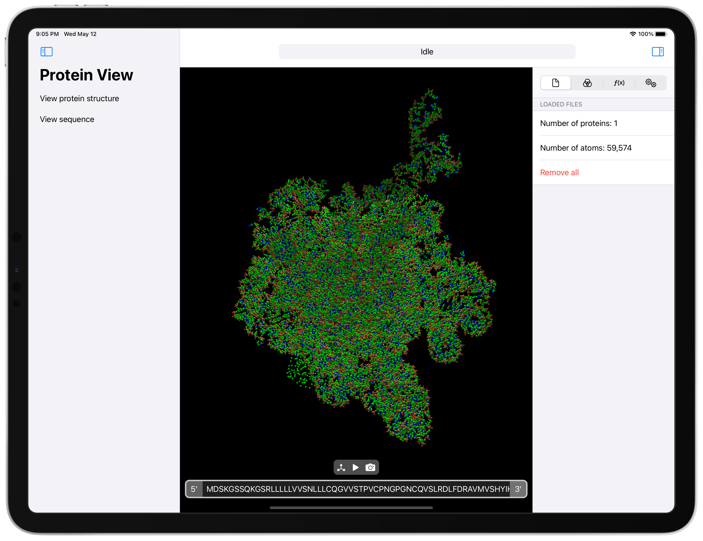

# BioViewer
Protein (.pdb, .cif and .fasta) viewer for iPhone, iPad and Mac, using SwiftUI + custom Metal engine.

## Implemented Metal optimizations
- Dynamic data is updated using a triple buffering scheme (the dynamic uniform buffer *FrameData* of the next render passes is computed and populated on the CPU while a previous GPU render command encoder is still running).
- Spheres are drawn using impostor geometries (a single *quad* is used for each sphere, and the sphere itself is drawn on the shading stage, allowing for far lower memory utilization and triangle count). This is a separate pipeline stage from the one drawing the opaque geometries (currently unused, but may be used in the future for more complex geometries like ⍺-helix or β-sheets that are harder to describe analytically).
- It does **NOT** use a rolling GPU time average to stabilise the framerate as in the initial testing it delievered consistently lower framerates (which is expected, but the perceived effect was not an improvement).
- It does **NOT** use frustum culling (yet!). It won't be useful when the protein is viewed as a whole, but it may save energy when viewing a zoomed-in version. Besides, since it requires subdividing the protein in smaller geometries (likely cubic chunks), the subdivision itself should be useful for other things (ambient occlusion, SDF for molecular surface generation...).
- It does **NOT** use anti-aliasing (yet!). The cheap to implement (for TBDR GPUs) MSAA does not work with shader effects, so it doesn't do anything to impostor geometries. Alternatives are super-sampling at 4x the resolution or using a post processing rendering pass using FXAA.

## Feature wish list
- Open PDB, CIF and FASTA files.
- Full drag & drop support on iOS, iPadOS and macOS.
- Support to open files from mail attachments, other apps and the Files app.
- Visual representation from PDB, CIF and FASTA files.
- Alignment of small FASTA files.
- Small scale protein folding from FASTA files + visual representation.
- Flexible coloring options for residues/atom types.
