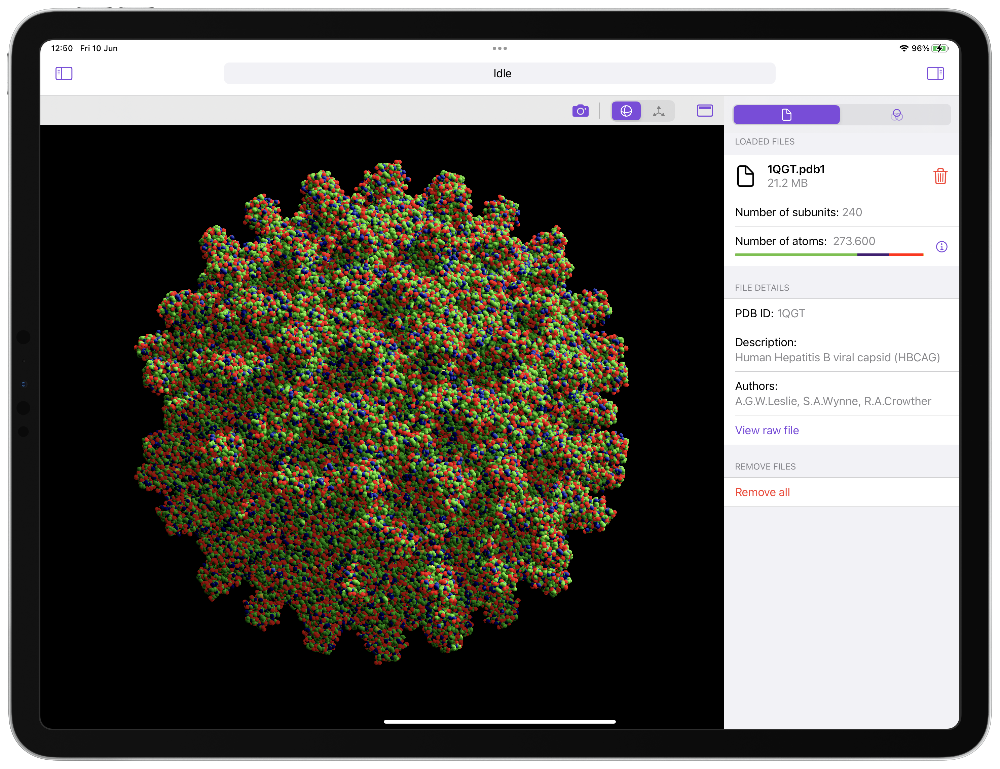
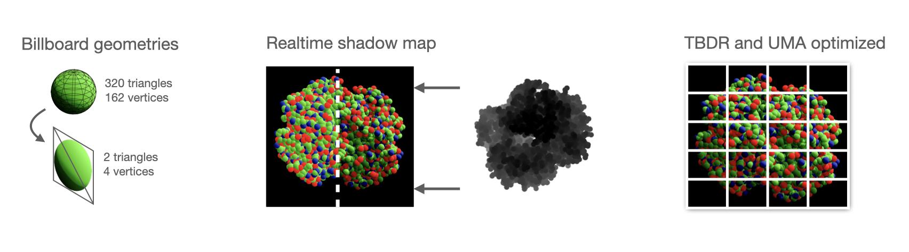

# BioViewer
Protein (.pdb, .cif and .fasta) viewer for iPhone, iPad and Mac, using SwiftUI + custom Metal engine.

## Documentation
Documentation is available at [https://androp0v.github.io/BioViewer/](https://androp0v.github.io/BioViewer/).

## Implemented Metal optimizations

- Dynamic data is updated using a triple buffering scheme (the dynamic uniform buffer *FrameData* of the next render passes is computed and populated on the CPU while a previous GPU render command encoder is still running).
- Spheres are drawn using impostor geometries (a single *quad* is used for each sphere, and the sphere itself is drawn on the shading stage, allowing for far lower memory utilization and triangle count). This is a separate pipeline stage from the one drawing the opaque geometries (currently unused, but may be used in the future for more complex geometries like ⍺-helix or β-sheets that are harder to describe analytically).
- Dynamic shadows are generated using a shadow map (drawing the scene from the sun's point of view and storing the depth of each point as seen by the sun). The shadows are later softened using Percentage Close Filtering (PCF), where for each pixel, several depth comparison relative to the same point seen by the sun's frame of reference are performed, slightly offset in a semi-random direction using a Vogel Disk sampling pattern, rotated by a pseudo-random angle ϕ generated using interleaved noise, taking the screen coordinates as the seed.
- Metal FX spatial upscaling is performed, allowing us to render the scene at a lower resolution.

## Possible future optimizations
- Cascade Shadow Maps (CSMs) could potentially be used to improve the resolution of the areas closer to the camera, but it's not yet implemented. Also, A15 Bionic and later GPUs support sparse depth textures which is ideal for the CSMs. 
- It does **NOT** use a rolling GPU time average to stabilise the framerate as in the initial testing it delievered consistently lower framerates (which is expected, but the perceived effect was not an improvement).
- It does **NOT** use frustum culling (yet!). It won't be useful when the protein is viewed as a whole, but it may save energy when viewing a zoomed-in version. Besides, since it requires subdividing the protein in smaller geometries (likely cubic chunks), the subdivision itself should be useful for other things (ambient occlusion, SDF for molecular surface generation...).
- It does **NOT** use anti-aliasing (yet!). The cheap to implement (for TBDR GPUs) MSAA does not work with shader effects, so it doesn't do anything to impostor geometries. Alternatives are super-sampling at 4x the resolution or using a post processing rendering pass using FXAA.

## Feature wish list
- Open PDB, CIF and FASTA files.
- Full drag & drop support on iOS, iPadOS and macOS.
- Support to open files from mail attachments, other apps and the Files app.
- Visual representation from PDB, CIF and FASTA files.
- Alignment of small FASTA files.
- Small scale protein folding from FASTA files + visual representation.
- Flexible coloring options for residues/atom types.
