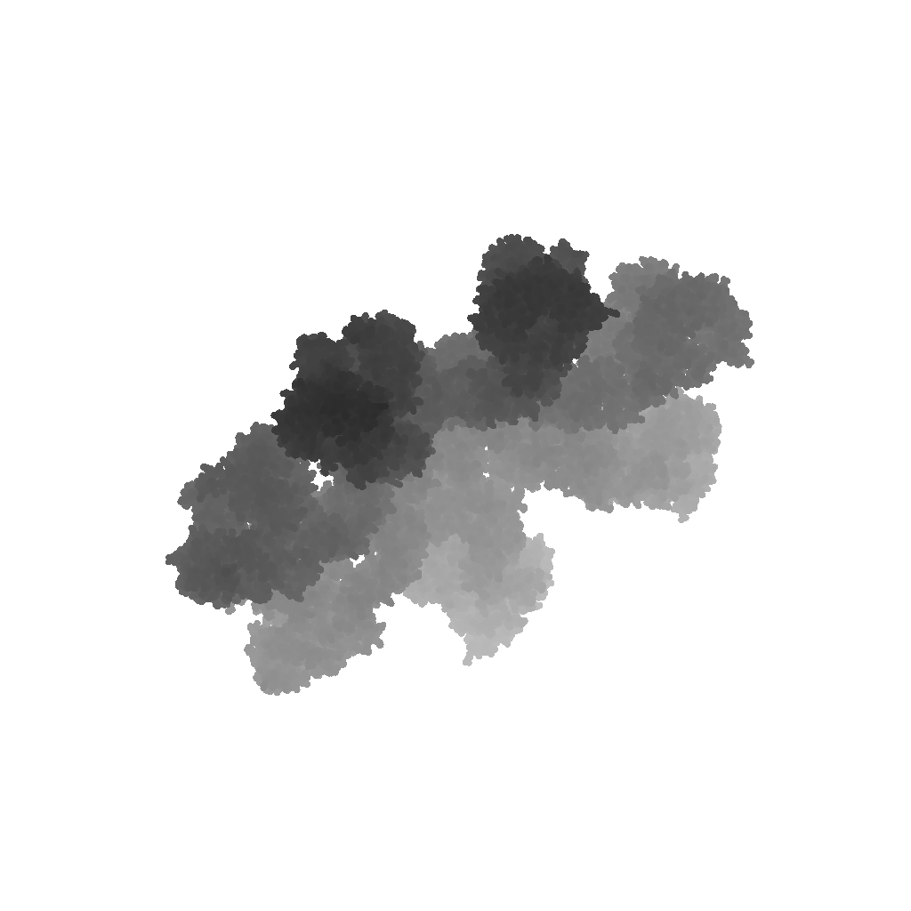
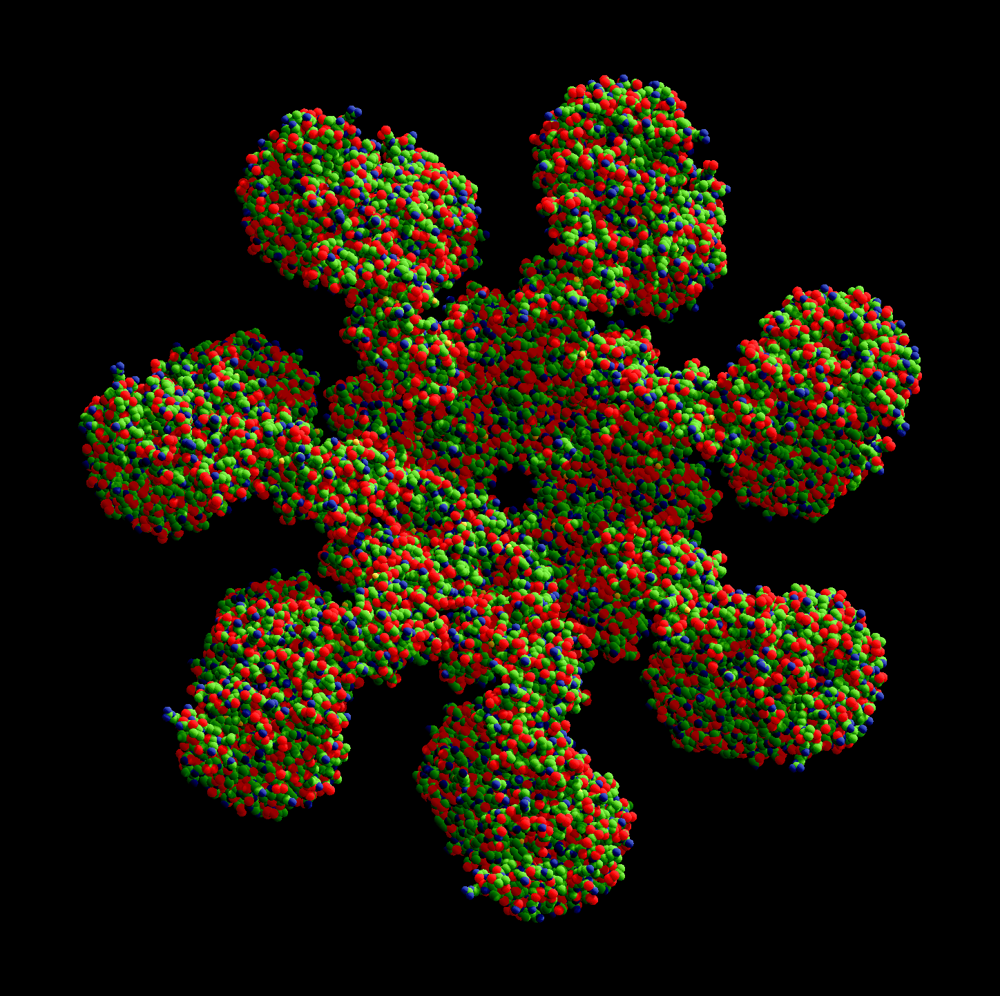
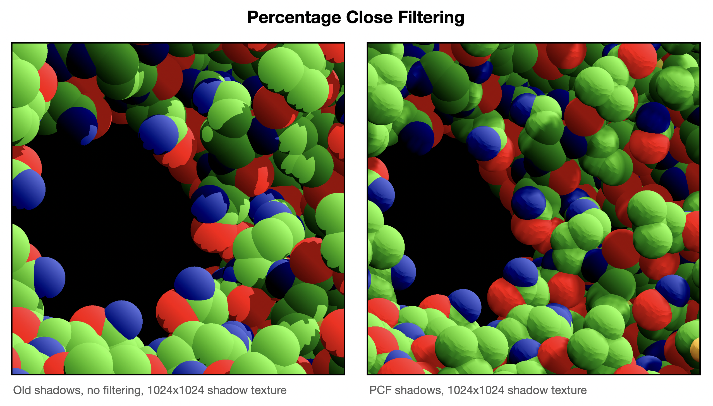

# Hard shadows

On a protein structure visualization tool, shadows are specially useful to convey the shape of the structure in a way our brain can interpret. This is readily apparent in the figures presented in Marco Tarini, Paolo Cignoni, and Claudio Montani, _Ambient Occlusion and Edge Cueing to Enhance Real Time Molecular Visualization_, the paper that inspired this project's shadow implementation (which actually implements ambient occlusion, not dynamic shadows, that's why I said 'inspired').

## How it's done

### Step 1


The first step is to create a texture with the depth information of the structure **as seen from the sun's frame of reference**. This uses an orthographic projection, since we approximate the sun as being infinitely far away an thus their rays being perfectly parallel (hence, an orthographic projection). This projection must fit the structure as tightly as possible, but avoiding leaving any part of it oustide the frame. Parts of the structure not seen on the main camera can still cast shadows seen on that camera.

The orthographic's projection near and far planes must be as tight as possible too. While we could generate a texture using near and far planes much further appart than required, the depth values would be compressed in a much smaller range (for example, ranging between 0.45 to 0.55 instead of the ideal 0.0 to 1.0). This causes a loss of precision that can cause shadow acne later on.

Since we are using impostor geometries to render the scene, we have to invoke the fragment shader to create the depth texture. To do that, we create a temporary texture, the equivalent of the final drawable texture on the normal render pass, so the fragment kernel gets called for each pixel of the image. Since we don't need this texture data (just the corresponding depth map), we can make this texture `loadAction = .dontCare` and `storeAction = .dontCare`. Also, on TBDR GPUs we can mark this texture `storageMode = .memoryless` too.

### Step 2

After the render pass in Step 1 renders the depth texture, we enqueue the render pass that draws the impostor geometries (the spheres). During the fragment function, we convert the coordinates of the sphere from camera space to the sun's frame of reference, in the same way we did in Step 1. 

```Metal
simd_float4x4 camera_to_shadow_projection_matrix = frameData.camera_to_shadow_projection_matrix;
float3 sphereShadowClipPosition = (camera_to_shadow_projection_matrix * float4(spherePosition.x,
                                                                               spherePosition.y,
                                                                               spherePosition.z,
                                                                               1.0)).xyz;
```

To be able to sample the sun's frame depth texture we need to convert the coordinates from Metal's Normalized Device Coordinates (NDC) to Metal's texture coordinates. To do that, we use:

```Metal
sphereShadowClipPosition.y *= -1;
sphereShadowClipPosition.xy += 1.0;
sphereShadowClipPosition.xy /= 2;
```

Then, we make a depth comparison using `sample_compare`. The shadow depth texture on the sun's frame of reference contains the depth of the closest occluder for a given `x` and `y` on that frame of reference. If the point seen in the camera render pass has a depth value greater than the one saved in the texture for the `x` and `y` values of that point in the sun's frame of reference, it means that it's occluded.

```Metal
float sunlit_fraction = 0;
constexpr int sample_count = 2;
for (int sample_index = 0; sample_index < sample_count; sample_index++) {
    // FIXME: 0.001 should be proportional to the typical atom size
    // TO-DO: VogelDiskSample may be called with a random number instead of 0 for the rotation
    half2 sample_offset = VogelDiskSample(0.001, sample_index, sample_count, 0);
    sunlit_fraction += shadowMap.sample_compare(shadowSampler,
                                                sphereShadowClipPosition.xy + float2(sample_offset),
                                                sphereShadowClipPosition.z);
}
```

If it's occluded, we substract some light from the final color of that pixel, creating the shadows.

```Metal
shadedColor.rgb -= frameData.shadow_strength * (1 - sunlit_fraction / sample_count);
```

### Step 3 (Optional) - Soften shadows

Directional shadows are hard. Since the resolution of the texture we use for the depth texture on the sun's frame of reference is limited, what we use to cast the shadows is not a perfect circle/sphere, but a 'pixelated' version of it. Think of when you create a circle in Minecraft using just a few blocks.

When the shadows are cast from that pixels, aliasing problems appear. _Specially_ if you cast them onto surfaces that are almost tangential to that direction (the sphere's sides, in out case). There are some cool algorithms to fix this problem, the coolest of them probably being Variance Shadow Maps (VSMs), which models each pixel as a distribution (of depth values) and uses the variance (the squared depth) to estimate the bounds of the distribution by recovering the moments of the distribution. But I digress. This cool method causes unwanted light leaks when there are too many occluders for a single `x` and `y` region (depth complexity). Since the pathological case for this algorithm is the expected case for our application, we have to discard this approach. Instead, we use what's called **Percentage Close Filtering**. Essentially, when sampling the sun's depth texture in Step 2, we sample neighbouring texture pixels and make an average, thus creating a soft shadow terminator.

As seen on the image, there are still some problems with the shadows that are not solved with PCF, but it's definitely a huge improvement.

## Gotchas

### Shadow acne
This is solved applying a small offset when computing the depth from the sun's frame of reference (Step 1). It's caused by the sampler in Step 2 returning a depth value just below the one stored in the texture created in Step 1 due to floating point precision issues.